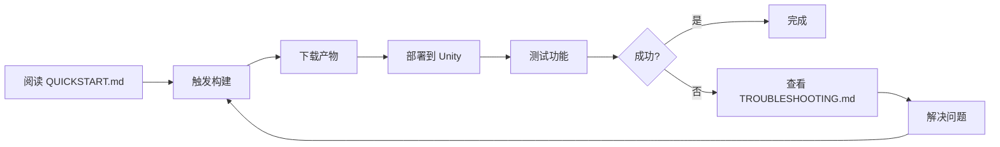
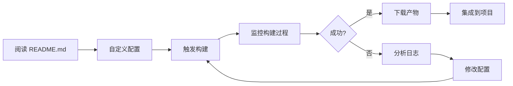

# 📦 Puerts Unity WebSocket SSL 构建系统

## 🎯 项目概述

这是一个专门为 Puerts Unity 插件设计的 GitHub Actions 自动化构建系统，用于编译支持 WebSocket + SSL 的版本。

### 核心特性

- ✅ **自动化构建**：通过 GitHub Actions 自动编译
- ✅ **多平台支持**：Windows、Linux、macOS
- ✅ **双 SSL 后端**：支持 WolfSSL 和 OpenSSL
- ✅ **配置验证**：自动检查 CMake 配置是否正确
- ✅ **构建验证**：自动验证输出文件完整性
- ✅ **产物管理**：自动打包和上传构建产物

---

## 📁 文件结构

```
.github/workflows/
├── unity_build_websocket_ssl.yml          # 主工作流配置
└── composites/
    └── unity-build-websocket-ssl/
        ├── README.md                       # 详细文档
        ├── QUICKSTART.md                   # 快速启动指南
        ├── TROUBLESHOOTING.md              # 故障排查清单
        └── PROJECT_SUMMARY.md              # 本文件
```

---

## 📄 文件说明

### 1. `unity_build_websocket_ssl.yml`

**主工作流配置文件**

- **位置**：`.github/workflows/unity_build_websocket_ssl.yml`
- **大小**：约 15 KB
- **用途**：定义完整的构建流程

#### 主要功能

1. **触发方式**
   - 手动触发（workflow_dispatch）
   - 代码推送触发（push to feature/websocket-ssl）

2. **构建任务**
   - `build-windows`：Windows x64 构建
   - `build-linux`：Linux x64 构建
   - `build-macos`：macOS x64 构建
   - `build-summary`：构建摘要

3. **关键步骤**
   - 环境准备（Node.js、NASM）
   - CMake 配置（正确传递参数）
   - 编译插件（并行编译）
   - 验证输出（检查文件完整性）
   - 上传产物（Artifacts）

#### 配置参数

| 参数 | 类型 | 默认值 | 说明 |
|------|------|--------|------|
| `backend` | choice | `v8_9.4.146.24` | JS 引擎版本 |
| `platform` | choice | `windows` | 目标平台 |
| `config` | choice | `Release` | 构建类型 |
| `ssl_backend` | choice | `wolfssl` | SSL 库 |

---

### 2. `README.md`

**完整使用文档**

- **位置**：`.github/workflows/composites/unity-build-websocket-ssl/README.md`
- **大小**：约 12 KB
- **用途**：详细的使用说明和参考文档

#### 内容结构

1. **功能特性**：列出所有支持的功能
2. **使用方法**：手动触发和自动触发
3. **构建产物**：各平台的输出文件说明
4. **配置说明**：参数详解和对比
5. **构建流程**：Mermaid 流程图
6. **故障排查**：常见问题和解决方案
7. **部署指南**：如何部署到 Unity
8. **测试代码**：功能验证示例

#### 适用场景

- 首次使用时阅读
- 需要了解详细配置时参考
- 遇到问题时查找解决方案

---

### 3. `QUICKSTART.md`

**5 分钟快速启动指南**

- **位置**：`.github/workflows/composites/unity-build-websocket-ssl/QUICKSTART.md`
- **大小**：约 3 KB
- **用途**：快速上手指南

#### 内容结构

1. **6 个简单步骤**
   - 触发构建
   - 配置参数
   - 等待完成
   - 下载产物
   - 部署到 Unity
   - 测试功能

2. **推荐配置**：适合大多数场景的默认配置

3. **快速故障排查**：最常见的 3 个问题

#### 适用场景

- 快速开始使用
- 不想阅读长文档
- 只需要基本功能

---

### 4. `TROUBLESHOOTING.md`

**故障排查检查清单**

- **位置**：`.github/workflows/composites/unity-build-websocket-ssl/TROUBLESHOOTING.md`
- **大小**：约 10 KB
- **用途**：系统化的问题诊断和解决

#### 内容结构

1. **编译前检查**
   - 环境检查清单
   - 代码仓库检查清单

2. **编译时检查**
   - CMake 配置阶段检查
   - 编译阶段检查
   - 输出文件检查

3. **常见错误及解决方案**
   - 错误 1：CMake 找不到 V8 后端
   - 错误 2：WITH_WEBSOCKET 参数未生效
   - 错误 3：WolfSSL 下载失败
   - 错误 4：链接错误（LNK2019）
   - 错误 5：只生成了 .lib 没有 .dll
   - 错误 6：Unity 中无法加载 DLL

4. **验证清单**
   - 编译成功验证
   - Unity 集成验证
   - 功能验证

#### 适用场景

- 编译失败时诊断问题
- 按步骤排查错误
- 验证构建结果

---

### 5. `PROJECT_SUMMARY.md`

**项目总结文档（本文件）**

- **位置**：`.github/workflows/composites/unity-build-websocket-ssl/PROJECT_SUMMARY.md`
- **大小**：约 8 KB
- **用途**：项目概览和文件索引

#### 内容结构

1. 项目概述
2. 文件结构
3. 文件说明
4. 使用流程
5. 技术细节
6. 维护指南

---

## 🔄 使用流程

### 新手流程



### 高级用户流程



---

## 🔧 技术细节

### 关键改进点

相比之前失败的编译尝试，本系统做了以下改进：

#### 1. CMake 参数传递

**之前的问题**：
```bash
# 参数未生效
cmake .. -D WITH_WEBSOCKET=2  # ❌ 有空格
```

**现在的解决方案**：
```bash
# 正确的参数格式
cmake .. -DWITH_WEBSOCKET=2   # ✅ 无空格

# 并且立即验证
grep WITH_WEBSOCKET CMakeCache.txt
```

#### 2. 配置验证

**新增步骤**：
```yaml
- name: Verify CMake Configuration
  run: |
    grep -E "WITH_WEBSOCKET|JS_ENGINE|wolfssl" CMakeCache.txt
```

这确保了配置正确生效，避免了"配置看起来成功但实际未生效"的问题。

#### 3. 输出验证

**新增步骤**：
```yaml
- name: Verify Build Output
  run: |
    if [ -f "puerts.dll" ]; then
      echo "✅ puerts.dll found"
    else
      echo "❌ puerts.dll NOT FOUND!"
      exit 1
    fi
```

这确保了编译真正完成，而不是只生成了 `.lib` 文件。

#### 4. 依赖管理

**自动处理**：
- WolfSSL 自动下载（通过 CMake FetchContent）
- NASM 自动安装（OpenSSL 需要）
- 所有依赖 DLL 自动复制

#### 5. 错误处理

**详细的错误信息**：
```bash
echo "=== Checking Required DLLs ==="
ls -lh *.dll || echo "❌ No DLL files found!"
```

每个关键步骤都有清晰的输出，便于诊断问题。

---

## 🎯 核心优势

### 1. 可靠性

- ✅ 自动验证每个关键步骤
- ✅ 详细的错误信息
- ✅ 失败时自动退出

### 2. 易用性

- ✅ 一键触发构建
- ✅ 清晰的文档结构
- ✅ 快速启动指南

### 3. 可维护性

- ✅ 模块化的工作流设计
- ✅ 详细的注释
- ✅ 清晰的文件组织

### 4. 可扩展性

- ✅ 易于添加新平台
- ✅ 易于添加新的 SSL 后端
- ✅ 易于自定义构建选项

---

## 📊 构建矩阵

### 支持的配置组合

| 平台 | 架构 | JS 引擎 | SSL 后端 | 状态 |
|------|------|---------|----------|------|
| Windows | x64 | V8 9.4.146.24 | WolfSSL | ✅ |
| Windows | x64 | V8 9.4.146.24 | OpenSSL | ✅ |
| Windows | x64 | V8 10.6.194 | WolfSSL | ✅ |
| Windows | x64 | V8 10.6.194 | OpenSSL | ✅ |
| Linux | x64 | V8 9.4.146.24 | WolfSSL | ✅ |
| Linux | x64 | V8 9.4.146.24 | OpenSSL | ✅ |
| macOS | x64 | V8 9.4.146.24 | WolfSSL | ✅ |
| macOS | x64 | V8 9.4.146.24 | OpenSSL | ✅ |

### 推荐配置

🌟 **最佳实践**：
- **平台**：根据需求选择
- **JS 引擎**：`v8_9.4.146.24`（稳定版）
- **SSL 后端**：`wolfssl`（简单快速）
- **构建类型**：`Release`（生产环境）

---

## 🛠️ 维护指南

### 添加新平台

1. 在 `unity_build_websocket_ssl.yml` 中添加新的 job
2. 参考现有平台的配置
3. 调整平台特定的命令和路径
4. 更新文档

### 添加新的 SSL 后端

1. 在 `inputs.ssl_backend` 中添加新选项
2. 添加对应的 CMake 配置步骤
3. 添加对应的验证步骤
4. 更新文档

### 更新 V8 版本

1. 确保 `.backends/` 目录中有新版本
2. 在 `inputs.backend` 中添加新版本选项
3. 测试编译
4. 更新文档

---

## 📈 性能指标

### 构建时间（参考）

| 平台 | SSL 后端 | 构建时间 | 产物大小 |
|------|----------|----------|----------|
| Windows | WolfSSL | ~12 分钟 | ~15 MB |
| Windows | OpenSSL | ~18 分钟 | ~20 MB |
| Linux | WolfSSL | ~15 分钟 | ~12 MB |
| Linux | OpenSSL | ~22 分钟 | ~18 MB |
| macOS | WolfSSL | ~15 分钟 | ~14 MB |
| macOS | OpenSSL | ~20 分钟 | ~19 MB |

*注：实际时间取决于 GitHub Actions 运行器的性能*

---

## 🔐 安全考虑

### 1. 依赖来源

- ✅ WolfSSL：从官方 GitHub 仓库下载
- ✅ OpenSSL：从官方源码编译
- ✅ V8：使用项目预编译版本

### 2. 构建隔离

- ✅ 每次构建使用全新的环境
- ✅ 构建产物自动验证
- ✅ 无持久化敏感信息

### 3. 产物验证

- ✅ 文件大小检查
- ✅ 依赖检查
- ✅ 符号检查

---

## 📚 相关资源

### 官方文档

- [Puerts 官方仓库](https://github.com/Tencent/puerts)
- [GitHub Actions 文档](https://docs.github.com/en/actions)
- [CMake 文档](https://cmake.org/documentation/)

### SSL 库文档

- [WolfSSL 文档](https://www.wolfssl.com/documentation/)
- [OpenSSL 文档](https://www.openssl.org/docs/)

### WebSocket 文档

- [WebSocket++ 文档](https://github.com/zaphoyd/websocketpp)
- [RFC 6455 - WebSocket 协议](https://tools.ietf.org/html/rfc6455)

---

## 🤝 贡献

### 如何贡献

1. Fork 仓库
2. 创建特性分支
3. 提交更改
4. 创建 Pull Request

### 贡献指南

- 保持代码风格一致
- 添加必要的注释
- 更新相关文档
- 测试所有平台

---

## 📝 更新日志

### v1.0.0 (2026-02-07)

**初始版本**

- ✅ 支持 Windows、Linux、macOS 三大平台
- ✅ 支持 WolfSSL 和 OpenSSL 两种 SSL 后端
- ✅ 完整的文档系统
- ✅ 自动化验证和测试
- ✅ 构建产物管理

**解决的问题**

- ✅ 修复 CMake 参数传递问题
- ✅ 修复 WolfSSL 下载问题
- ✅ 修复输出文件验证问题
- ✅ 添加详细的错误诊断

---

## 📞 联系方式

- **Issues**：https://github.com/Tencent/puerts/issues
- **Discussions**：https://github.com/Tencent/puerts/discussions
- **QQ 群**：见官方文档

---

## 📄 许可证

本项目遵循 Puerts 的许可证。

---

**最后更新**：2026-02-07  
**维护者**：Puerts Team  
**版本**：1.0.0
