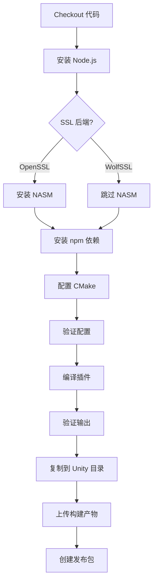

# Puerts Unity WebSocket SSL Build Action

这是一个专门用于编译支持 WebSocket + SSL 的 Puerts Unity 插件的 GitHub Actions 工作流。

## 🎯 功能特性

- ✅ 支持 WebSocket (`ws://`) 连接
- ✅ 支持 WebSocket Secure (`wss://`) 连接
- ✅ 支持 WolfSSL 和 OpenSSL 两种 SSL 后端
- ✅ 支持 Windows、Linux、macOS 三大平台
- ✅ 自动验证编译配置和输出
- ✅ 自动打包和上传构建产物

## 🚀 使用方法

### 方法 1：手动触发（推荐）

1. 进入 GitHub 仓库的 **Actions** 标签页
2. 选择 **"Build Puerts Unity Plugin with WebSocket SSL Support"** 工作流
3. 点击 **"Run workflow"** 按钮
4. 配置构建参数：
   - **JavaScript Backend**: 选择 V8 引擎版本（默认：`v8_9.4.146.24`）
   - **Target Platform**: 选择目标平台（`windows`/`linux`/`osx`/`all`）
   - **Build Configuration**: 选择构建类型（`Release`/`Debug`）
   - **SSL Backend**: 选择 SSL 库（`wolfssl`/`openssl`）
5. 点击 **"Run workflow"** 开始构建

### 方法 2：代码推送触发

当推送代码到 `feature/websocket-ssl` 分支时，会自动触发构建：

```bash
git checkout -b feature/websocket-ssl
git add .
git commit -m "Update WebSocket SSL support"
git push origin feature/websocket-ssl
```

## 📦 构建产物

构建完成后，可以在 Actions 页面的 **Artifacts** 部分下载：

### Windows 平台
- `puerts-windows-x64-websocket-ssl-{backend}-{ssl}.zip`
- 包含文件：
  - `puerts.dll` - 主插件
  - `v8.dll` - V8 引擎
  - `v8_libplatform.dll` - V8 平台库
  - `v8_libbase.dll` - V8 基础库
  - `zlib.dll` - 压缩库
  - `wolfssl.dll` 或 `openssl.dll` - SSL 库

### Linux 平台
- `puerts-linux-x64-websocket-ssl-{backend}-{ssl}.tar.gz`
- 包含文件：
  - `libpuerts.so` - 主插件
  - 其他依赖的 `.so` 文件

### macOS 平台
- `puerts-macos-x64-websocket-ssl-{backend}-{ssl}.tar.gz`
- 包含文件：
  - `libpuerts.dylib` - 主插件
  - 其他依赖的 `.dylib` 文件

## 🔧 配置说明

### WebSocket 模式

工作流使用 `WITH_WEBSOCKET=2`（WolfSSL）或 `WITH_WEBSOCKET=3`（OpenSSL）：

| 值 | 说明 | SSL 支持 |
|----|------|----------|
| 0 | 禁用 WebSocket | ❌ |
| 1 | 仅 WebSocket（无 SSL） | ❌ |
| 2 | WebSocket + WolfSSL | ✅ |
| 3 | WebSocket + OpenSSL | ✅ |

### SSL 后端对比

| 特性 | WolfSSL | OpenSSL |
|------|---------|---------|
| **自动下载** | ✅ 是 | ❌ 需要 NASM |
| **编译速度** | ⚡ 快 | 🐢 慢 |
| **体积** | 📦 小 | 📦 大 |
| **兼容性** | ✅ 兼容 OpenSSL API | ✅ 原生 |
| **推荐度** | ⭐⭐⭐⭐⭐ | ⭐⭐⭐ |

**推荐使用 WolfSSL**，除非有特殊需求。

## 📋 构建流程

### Windows 构建流程



### 关键步骤说明

1. **配置 CMake**
   - 使用 Visual Studio 2022 生成器（Windows）
   - 传递正确的 `WITH_WEBSOCKET` 参数
   - 指定 JS 引擎版本

2. **验证配置**
   - 检查 `CMakeCache.txt` 中的关键参数
   - 确保 `WITH_WEBSOCKET` 和 `JS_ENGINE` 正确设置
   - 验证 SSL 库配置

3. **编译插件**
   - 使用并行编译加速构建
   - Windows: 4 个并行任务
   - Linux: 使用所有 CPU 核心
   - macOS: 使用所有 CPU 核心

4. **验证输出**
   - 检查 `puerts.dll`/`libpuerts.so`/`libpuerts.dylib` 是否存在
   - 检查 SSL 库是否正确生成
   - 列出所有生成的库文件

## 🐛 故障排查

### 问题 1：CMake 配置失败

**症状**：
```
CMake Error: Could not find CMAKE_ROOT
```

**解决方法**：
- 确保 CMake 版本 >= 3.15
- 检查 V8 后端是否存在于 `.backends/` 目录

### 问题 2：WolfSSL 下载失败

**症状**：
```
Failed to download wolfssl repository
```

**解决方法**：
- 检查网络连接
- 可能需要配置 Git 代理
- 或者切换到 OpenSSL 后端

### 问题 3：编译时找不到 V8 头文件

**症状**：
```
fatal error: v8.h: No such file or directory
```

**解决方法**：
- 确保 V8 后端已正确下载
- 检查 `JS_ENGINE` 参数是否正确
- 尝试使用 `v8` 而不是具体版本号（自动检测）

### 问题 4：链接错误

**症状**：
```
error LNK2019: unresolved external symbol
```

**解决方法**：
- 清理构建目录重新编译
- 确保 V8 库文件存在
- 检查 CMake 配置是否正确

### 问题 5：生成的 DLL 缺失

**症状**：
- 只有 `.lib` 和 `.exp` 文件，没有 `.dll`

**解决方法**：
- 检查编译日志中的错误
- 确保 `WITH_WEBSOCKET` 参数正确传递
- 验证 CMakeCache.txt 中的配置

## 📝 部署到 Unity

### 1. 下载构建产物

从 GitHub Actions 的 Artifacts 部分下载对应平台的压缩包。

### 2. 解压文件

```bash
# Windows
unzip puerts-windows-x64-websocket-ssl-v8_9.4.146.24-wolfssl.zip

# Linux/macOS
tar -xzf puerts-linux-x64-websocket-ssl-v8_9.4.146.24-wolfssl.tar.gz
```

### 3. 复制到 Unity 项目

```
YourUnityProject/
└── Assets/
    └── Plugins/
        ├── Windows/
        │   └── x86_64/
        │       ├── puerts.dll
        │       ├── v8.dll
        │       ├── v8_libplatform.dll
        │       ├── v8_libbase.dll
        │       ├── zlib.dll
        │       └── wolfssl.dll
        ├── Linux/
        │   └── x86_64/
        │       └── libpuerts.so
        └── macOS/
            └── libpuerts.dylib
```

### 4. 配置 Unity 插件设置

1. 在 Unity 编辑器中选择 DLL 文件
2. 在 Inspector 中设置：
   - **Platform Settings > Any Platform**: 取消勾选
   - **Platform Settings > Windows**: 勾选
   - **Platform Settings > Windows > CPU**: 选择 `x86_64`
   - 对其他平台重复此操作

## 🧪 测试 WebSocket SSL 功能

### JavaScript 测试代码

```javascript
const WebSocket = require('ws');

// 测试普通 WebSocket
const ws = new WebSocket('ws://echo.websocket.org');
ws.on('open', () => {
    console.log('✅ ws:// connected!');
    ws.send('Hello WebSocket');
});
ws.on('message', (data) => {
    console.log('📨 Received:', data);
});

// 测试 WebSocket Secure
const wss = new WebSocket('wss://echo.websocket.org');
wss.on('open', () => {
    console.log('✅ wss:// connected!');
    wss.send('Hello Secure WebSocket');
});
wss.on('message', (data) => {
    console.log('🔒 Secure received:', data);
});
wss.on('error', (error) => {
    console.error('❌ Error:', error);
});
```

### C# 测试代码

```csharp
using UnityEngine;
using Puerts;

public class WebSocketTest : MonoBehaviour
{
    private JsEnv jsEnv;

    void Start()
    {
        jsEnv = new JsEnv(new DefaultLoader());
        
        // 执行测试脚本
        jsEnv.Eval(@"
            const WebSocket = require('ws');
            
            const wss = new WebSocket('wss://echo.websocket.org');
            wss.on('open', () => {
                console.log('WebSocket Secure connected!');
                wss.send('Test from Unity');
            });
            wss.on('message', (data) => {
                console.log('Received:', data);
            });
        ");
    }

    void Update()
    {
        jsEnv?.Tick();
    }

    void OnDestroy()
    {
        jsEnv?.Dispose();
    }
}
```

## 📚 相关文档

- [Puerts 官方文档](https://github.com/Tencent/puerts)
- [WebSocket++ 文档](https://github.com/zaphoyd/websocketpp)
- [WolfSSL 文档](https://www.wolfssl.com/documentation/)
- [CMake 文档](https://cmake.org/documentation/)

## 🤝 贡献

如果发现问题或有改进建议，请：

1. 提交 Issue 描述问题
2. Fork 仓库并创建分支
3. 提交 Pull Request

## 📄 许可证

本工作流配置遵循 Puerts 项目的许可证。

---

**最后更新**: 2026-02-07
**维护者**: Puerts Team
